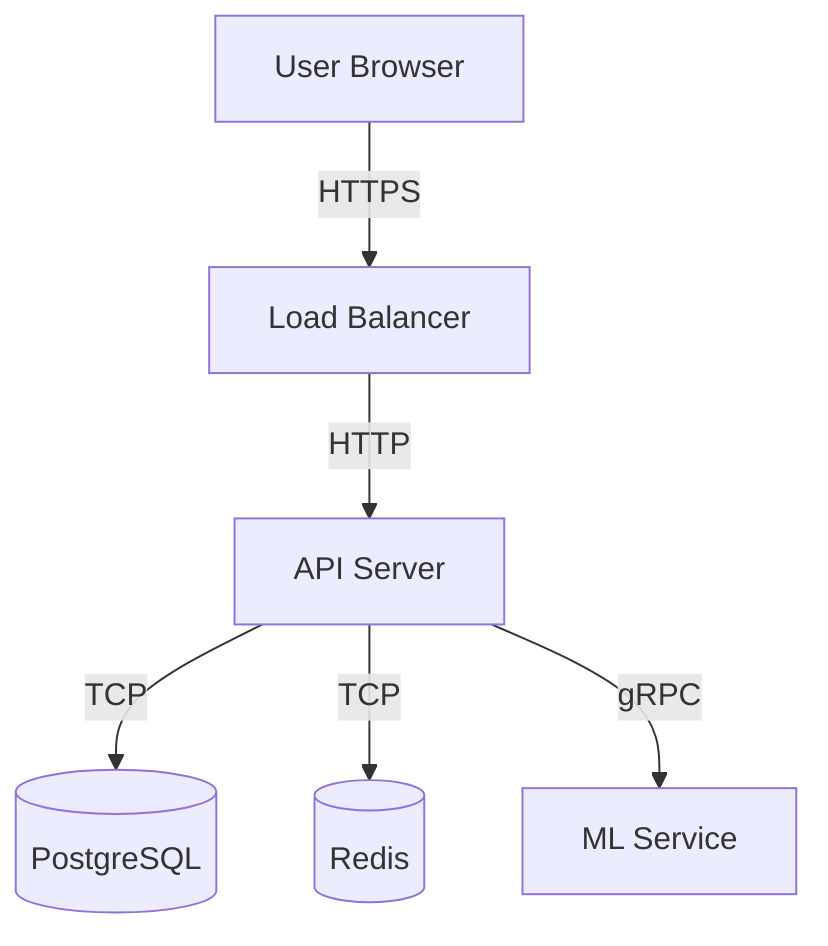

# Architecture Documentation Patterns

## Purpose

Provide reusable patterns for documenting software architecture: system context, component structure, decision records, and operational characteristics. [general]

## Architecture Document Types

| Type | Audience | Scope | Update Frequency |
| --- | --- | --- | --- |
| System Context Diagram | All stakeholders | External boundaries, actors, integrations | Per major release |
| Component Diagram | Engineers | Internal modules, dependencies, data flow | Per sprint (if changed) |
| Architecture Decision Record (ADR) | Engineers, leads | Single decision with context and consequences | Per decision |
| Deployment Diagram | DevOps, SRE | Infrastructure, networking, scaling | Per infra change |
| Data Flow Diagram | Engineers, security | Data movement, transformations, storage | Per data model change |
| Sequence Diagram | Engineers | Runtime interaction between components | Per feature |

## C4 Model Documentation

The C4 model provides four zoom levels for architecture diagrams. [general]

### Level 1: System Context

Documents what the system is and who uses it. [general]

Template:
```
System: [Name]
Purpose: [One sentence]
Users: [Actor 1], [Actor 2]
External Systems: [System A] (protocol), [System B] (protocol)
```

### Level 2: Container

Documents the high-level technology choices and container boundaries. [general]

| Container | Technology | Purpose | Communication |
| --- | --- | --- | --- |
| Web App | React, TypeScript | User interface | HTTPS to API |
| API Server | Python, FastAPI | Business logic, orchestration | REST/JSON |
| Database | PostgreSQL 15 | Persistent storage | TCP/5432 |
| Message Queue | Redis Streams | Async job processing | TCP/6379 |

### Level 3: Component

Documents the internal structure of a single container. [general]

| Component | Responsibility | Dependencies |
| --- | --- | --- |
| Router | Request routing and skill dispatch | Schemas, Hooks |
| Hooks | Pre/post processing pipeline | Cognitive state, Validators |
| Validators | Output contract enforcement | Schemas |

### Level 4: Code

Documents class/function level detail. Reserve for critical or complex code paths only. [general]

## Architecture Decision Records (ADR)

### ADR Template

```markdown
# ADR-NNN: [Title]

## Status
[Proposed | Accepted | Deprecated | Superseded by ADR-NNN]

## Context
[What is the issue? What forces are at play?]

## Decision
[What is the change being proposed or decided?]

## Consequences
### Positive
- [Benefit 1]
- [Benefit 2]

### Negative
- [Cost 1]
- [Risk 1]

### Neutral
- [Tradeoff 1]

## Alternatives Considered

| Alternative | Pros | Cons | Why Rejected |
| --- | --- | --- | --- |
| [Option A] | [Pro] | [Con] | [Reason] |
| [Option B] | [Pro] | [Con] | [Reason] |
```

### ADR Rules

1. Number ADRs sequentially (ADR-001, ADR-002). Never reuse numbers. [general]
2. One decision per ADR. Compound decisions get separate records. [general]
3. Write the Context section for someone who was not in the meeting. [general]
4. Include rejected alternatives with reasons. Future readers need the "why not". [observed]
5. Mark deprecated ADRs; link to the superseding ADR. [general]
6. Store ADRs in version control alongside the code they describe. [observed]

## Non-Functional Requirements Documentation

| Attribute | Document | Example |
| --- | --- | --- |
| Performance | Latency targets, throughput, benchmarks | P99 < 200ms at 1000 RPS |
| Scalability | Scaling strategy, bottlenecks, limits | Horizontal pod autoscaler, max 50 replicas |
| Reliability | SLO, failure modes, recovery procedures | 99.9% uptime, RTO < 5min |
| Security | Threat model, auth flow, data classification | OAuth2 + mTLS, PII encrypted at rest |
| Observability | Metrics, logs, traces, alerting | OpenTelemetry, Prometheus, Grafana |

## Diagram Standards

### Rules for Architecture Diagrams

1. Every box must have a label and a one-line description. [general]
2. Every arrow must have a label (protocol, data type, direction). [general]
3. Use consistent color coding: green for external, blue for internal, red for data stores. [general]
4. Include a legend on every diagram. [observed]
5. Date and version every diagram. [general]
6. Store diagram source files (PlantUML, Mermaid, draw.io XML) in version control. [observed]
7. Never use screenshots of whiteboards as permanent documentation. [general]

### Mermaid Diagram Example



## Documenting System Invariants

Invariants are properties that must always hold true. Document them explicitly. [general]

| Invariant | Scope | Enforcement | Violation Response |
| --- | --- | --- | --- |
| All API responses under 500ms P99 | API Server | Performance monitoring | Alert, scale, investigate |
| No PII in application logs | All services | Log sanitization middleware | Block deployment, remediate |
| Database migrations are backward-compatible | Schema changes | CI migration check | Reject PR |
| Single active thread per session | Cognitive runtime | Monotropism guard | Announce topic shift |

## Anti-Patterns

| Anti-Pattern | Why It Fails | Fix |
| --- | --- | --- |
| "The architecture is in my head" | Bus factor of one; knowledge loss on turnover | Write it down in version control |
| Diagrams without labels | Readers cannot interpret unlabeled boxes and arrows | Label every element and connection |
| ADRs written after the fact | Missing context and alternatives | Write the ADR before or during the decision |
| Architecture docs in a wiki nobody reads | Docs drift from reality | Store alongside code; review in PRs |
| Documenting only the happy path | Failures are where architecture matters most | Document failure modes and recovery |

## Grounding Checklist

Before publishing architecture documentation, verify: [observed]
- [ ] System context diagram shows all external actors and integrations
- [ ] Component boundaries match the actual codebase structure
- [ ] ADRs exist for every significant architectural decision
- [ ] Diagrams have labels, legends, dates, and version numbers
- [ ] Non-functional requirements have measurable targets
- [ ] Invariants are documented with enforcement mechanisms
- [ ] Diagram source files are in version control (not just images)
